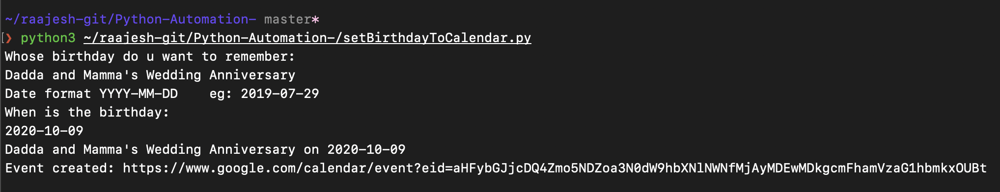
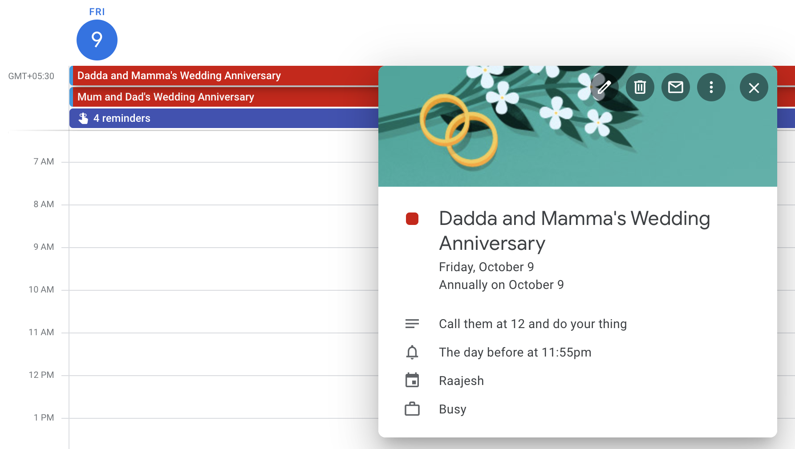

# Automation Scripts
This repo hosts a collection of all my automation scripts. If any interests you, feel free to use it

---

### Set Birthday To Calendar

This script automates the process of creating a birthday event for a person with the reminder of it 5 mins before 12 midnight 
And it repeats itself annually using Google Calendar API

Follow the first 2 steps for setup 

    https://developers.google.com/calendar/quickstart/python#step_1_turn_on_the

*Requirement: **credentials.json** for your Google Account must be placed along with the script*

I set up my parents' wedding anniversary!

  
  

---

### Auto Duo-Authenticator

While connecting to Cisco's AnyConnect Vpn the Duo Authenticator push notifications are generated and we are required to expand and press allow via notifications or via the Duo application

This sequence got mundane so i created a flow in Automate app that automatically simulates the accept notification trigger generated by Duo app.

#### Installation steps are as follows.

- Download *DuoAutoAuthenticator.flo*
- Install **Automate** by **LlamaLab** from Google Play Store
- Import > Choose *DuoAutoAuthenticator.flo* 
- Grant the necessary permissions & Hide the notifications from Automate as they might be annoying at times.

Now generate a new connect request from AnyConnect and watch ur phone automatically accept the notification request. This works even when the phone is locked. 

Feel free to double check if there is any flows that you don't want to execute

#### cerner_2^5_2020

Including this tag for a programming event at Cerner to submit DuoAutoAuthenticator.flo as an entry. This is a flow based code and might be harder to be classified with 32 line rule (Look into the flow from Automate app to view/edit the code). But this could be categorized under "engineering productivity" as it saves quite a lot of frustration and time each day

---